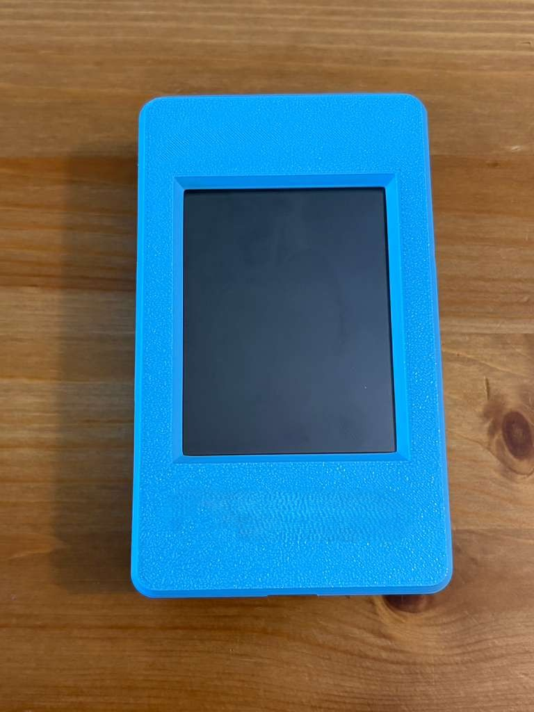
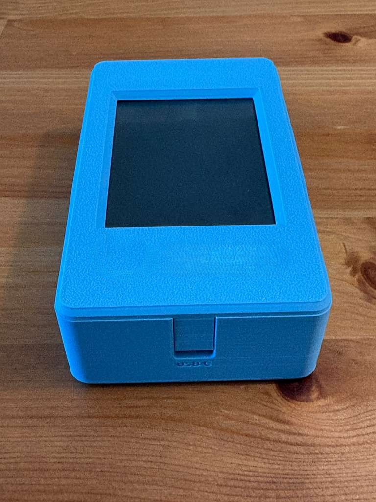

# Portable [LP4502](https://www.mercury-security.com/products/lp4502/) Programming Device
## Overview

This project defines a portable, handheld programming and diagnostics device for electronic gate, door, and lift control systems used in buildings, hotels, and industrial facilities.

The device replaces the need for technicians to carry laptops on-site for maintenance, calibration, troubleshooting, and data extraction. It provides a compact, touchscreen-based solution capable of interfacing directly with control boards via Ethernet, operating fully offline, and synchronizing data to the cloud when connectivity is available.

The project is designed as an open-source access control and diagnostics platform for building technicians and engineers.

## Problem Statement
Maintenance and troubleshooting of electronic access systems typically require:

- A laptop 
- Vendor-specific software
- Cables, adapters, and power access
- On-site configuration and data extraction under time constraints

This results in:
- Increased setup time
- Reduced portability
- Operational friction for technicians
- Inconsistent data collection and reporting

There is a need for a dedicated, portable, purpose-built device that simplifies field maintenance while remaining flexible, secure, and extensible.

## Description
A portable, handheld programming and diagnostics device for electronic gates, doors, and lift control systems. Designed for building technicians and field engineers, the device eliminates the need for laptops by providing a touchscreen-based interface to configure, test, and troubleshoot access control boards directly over Ethernet. It operates fully offline, stores logs locally, and synchronizes data to the cloud when connectivity is available.

## Target Users
- Building maintenance technicians
- Field service engineers
- Access control system integrators
- Facility management teams

## Hardware Platform
- MCU: ESP32
- Networking: Ethernet PHY (RJ45)
- Display: Integrated touchscreen
- Storage: On-device non-volatile storage
- Power: Portable (battery-powered or external supply)

## User Interface
- Touchscreen-based interface
- Embedded web UI
- Technician-friendly workflows
- Minimal configuration overhead

## Deliverables
- Custom hardware design (PCB)
- Embedded firmware (ESP32)
- Touch-based web UI
- Documentation and usage guides
- Open-source repository with PRD, schematics, and firmware

## System Block Diagram

## LoRa Shield (RFM95)

